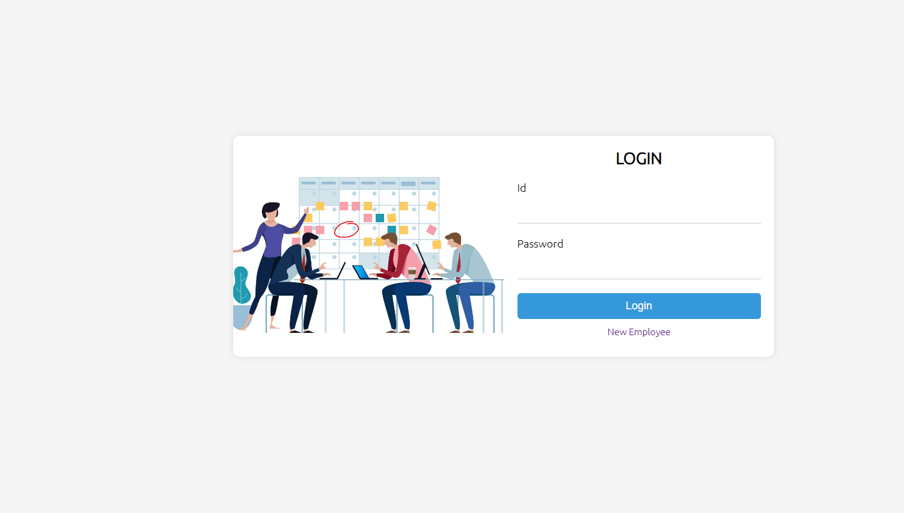
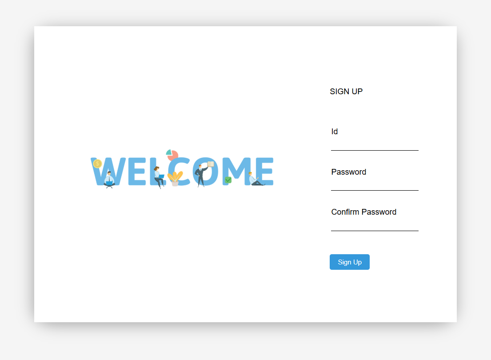
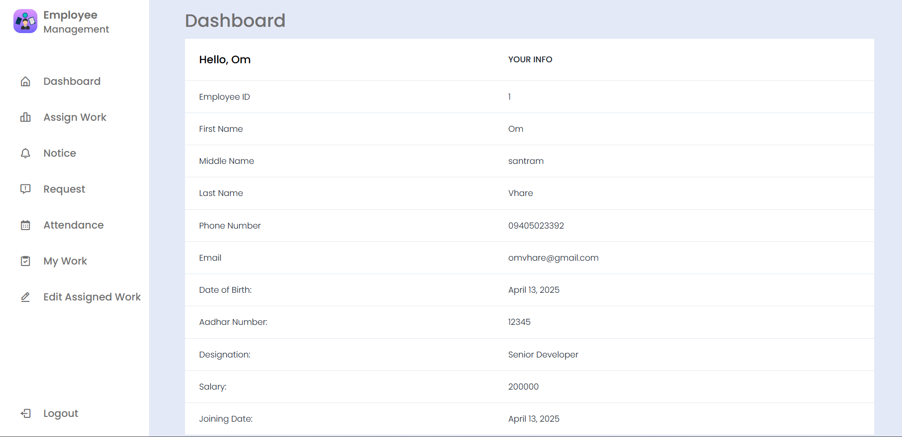
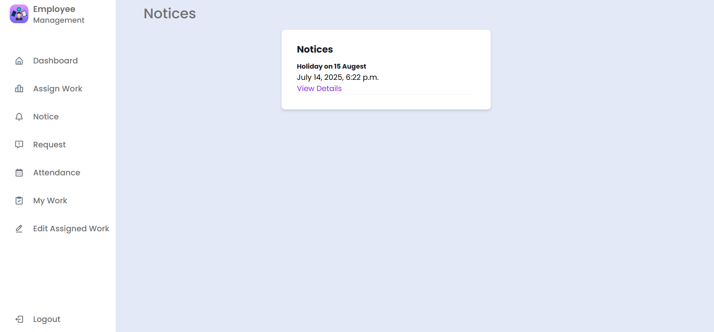

# Employee Management System - Django(Python)

Employee Management System built in a Python Framework Django and PostgreSQL as Database. This webapp include the functionality like...

1. Login / Registration (Admin, Employee)
2. Add / Manage Employee (Admin)
3. Publish / Manage Notice (Admin)
4. Add / Manage Attendance (Admin)
5. Assign / Manage Work (Employee)
6. Send Request (Employee)
7. View Request, Notice, Works etc...

## How to Use this Project?
***
- Install Python to your System.
- Run Following command to your terminal.
    ```python
    pip install django
    ```
- Install Pipenv for Virtual Environment, run the command...
    ```python
    pip install pipenv
    ```
- Clone the repository to your local system.
- Enter in Virtual Environment by running following command in Current Working Directory.
    ```python
    pipenv shell
    ```
- Setup PostgreSQL Database and update database name and password in settings.py file in employeemanagement.
- Make the Migrations, run the command
    ```python
    python manage.py makemigrations
    ```
- Migrate the App, run the command
    ```python
    python manage.py migrate
    ```
- Finally Run the App, run the command.
    ```python
    python manage.py runserver
    ```
- Hola, It's running !!

- ## 🖼️ Screenshots

### 🔹 Login Page


### 🔹 User Registration


### 🔹 Admin Dashboard


### 🔹 Admin – Employee Management


### 🔹 Admin – Attendance View


### 🔹 Admin – Notices


### 🔹 Assign Work to Employees


### 🔹 View Notice Board (Employee)


### 🔹 Employee – Make a Request


### 🔹 Employee – Your Attendance


### 🔹 Employee – Assigned Work View


### 🔹 Employee – My Work


---


>If you found this useful, make sure to give it a star 🌟

## Thank You!!
